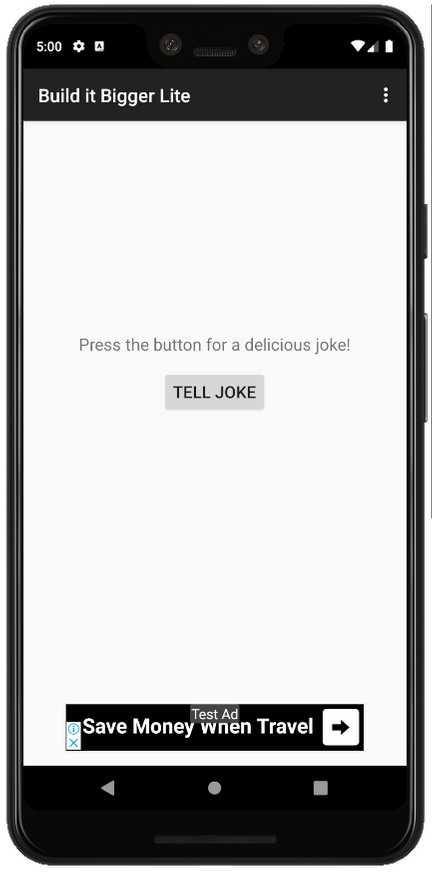

# Build It Bigger

In Project 5 of the Udacity Android Developer Nanodegree Program, **Build It Bigger** was developed in order to test: 

* Adding free and paid flavors to an app, and setting up a build to share code between them
* Factoring reusable functionality into a Java library
* Factoring reusable Android functionality into an Android library
* Configuring a multi project build to compile libraries and app
* Using the Gradle App Engine plugin to deploy a backend
* Configuring an integration test suite that runs against the local App Engine development server

## Features
The app consists of 4 modules:
- A Java library that provides jokes
- A Google Cloud Endpoints (GCE) project that serves those jokes
- An Android Library containing an activity for displaying jokes
- An Android app that fetches jokes from the GCE module and passes them to the Android Library for display.

## Screenshots
 
 
